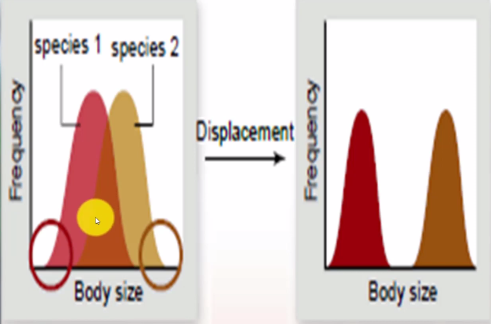
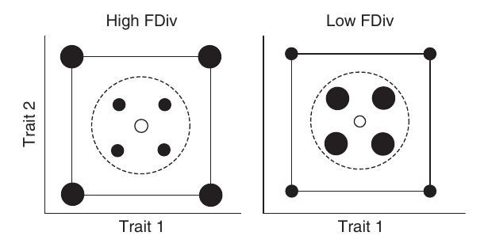

# Introduction

**Ecospace**
{height=70%}

# How the Ecology of Past Utilized? 
 There has been many hypothesis to explain the utilization of ecospace of past.
 
- These hypothesis can be generalized into four models of ecological diversification.

# Four Models of Ecologocial Diversification
{height=80%}

# Potential Mechanism: Expansion 

{height=70%}

*Hey !! we don't want to fight, let's be strong at our own places.*

# Potential Mechanism: Expansion

# Potential Mechanism: Expansion
{height=70%}

# Potential Mechanism: Expansion
## Few more
Key innovation, habitat colonization, increased nutrient availability etc.

# Potential Mechanism: Redundancy

::: incremental

* **Niche Conservatism**
The tendency of species to retain ancestral ecological characteristic.

* **Competition- Colonization trade-offs** that allow poorer competitors to resist extinction by virtue of higher dispersal rates- can maintain redundancy by restricting opportunities for local competitive interactions.
:::
# Potential Mechanism: Redundancy
{height=75%}

# Potential Mechanism: Redundancy

**Disruption in competitive interactions** lead to increase in degree of redundancy.
Sometimes Keystone species (and predation help in disrupting the competition.

**Keystone species** hold together the complex web of relationships in an ecosystem.

e.g., The foxes prey on other species and help to keep their populations down.

# Potential Mechanism: Partitioning
In a generalized sense, partitioning is a form of resource specialization.
{height=90%}

# Potential Mechanism: Partitioning
## Ecological fitting
An organism continues to exploit the same resources, but in a new host or environment. 

# Potential Causal Mechanism: Neutral 
 Not a cause driven model, its a passive model which is random.

# Statstical Metrics used 

::: incremental
- Functional Richness (FRic)- Volume of the functional space occupied by the community.

[Calculated by Quick hull algorithm](https://www.youtube.com/watch?v=2EKIZrimeuk&t=62s)

- Functional Evenness (FEve)- the evenness of the abundance distribution in a functional trait space.

:::

# Statstical Metrics used 

- Functional Divergence (FDiv)- FDiv measures the degree to which the abundance of a community is distributed toward the extremities of occupied functional trait space.
 

# Statstical Metrics used 

::: incremental 
- Life habit richness (H)- Number of unique trait combinations.

- Maximum Distance (M)- Maximum pairwise distance between two species in functional trait space.

- Mean Distance (D)- Average distance between pairs of species in ecospace.

- Total Variance (V)- Sum variances for each trait across species.
- Functional Dispersion (FDis)
::: 
# Distingusih the models 

::: incremental 

## Redundancy models
- Life-habit richness (H) values far lower than species richness(S)
- Low H values and declining or low, nearly constant disparity values.

## Partitionoing 
- Declining trends in all statistics (except for certain such as FRic and M, that will increase slowly).
- Linear gradients are present in ecospace occupation.
:::
Discrete clumps in Redundancy whereas Partitioning model shows are more continuously distributed life habits. 

# Expansion vs Neutral 
::: incremental 
- The rate of increase will be slightly greater for the expansion model.
- The centroid will often (but not always) be empty as the model progresses in expansion but will typically occupied in Neutral.

- ***Need large ecospace frameworks with many characters***
:::
# Dyanamics and Mechanism of Models

